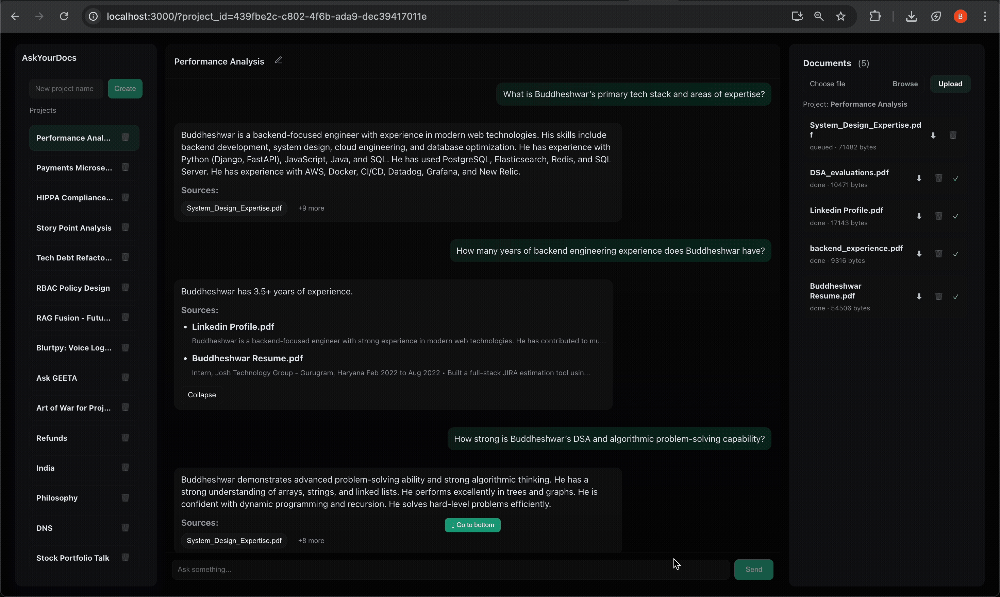
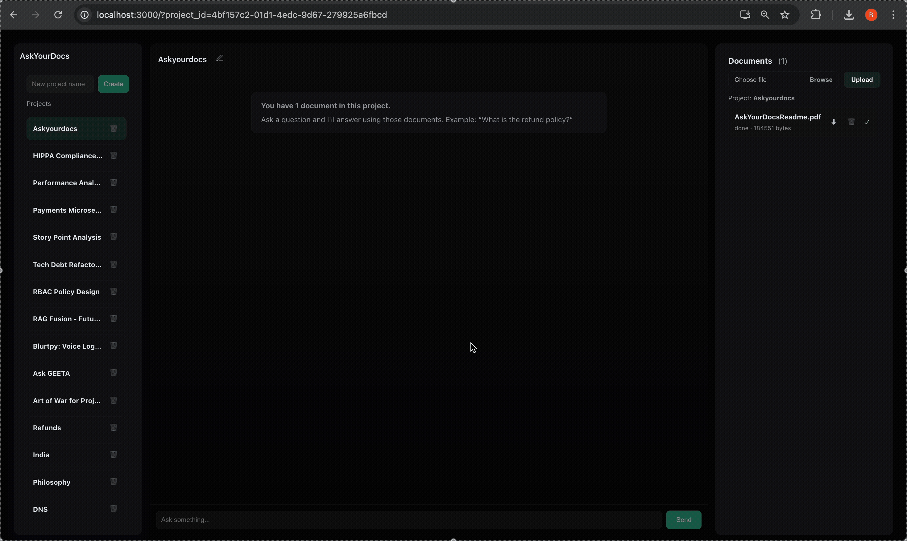

# Ask Your Docs: Retrieval-Augmented Generation (RAG) System

## Project Summary

**Ask Your Docs** is a full-stack, end-to-end **Retrieval-Augmented Generation (RAG) system** designed to provide accurate, context-aware Q&A capabilities over proprietary and unstructured document corpora.

## Key Features

### Retrieval & Intelligence

- **Contextual Q&A**  
  Retrieves semantically relevant document chunks from an indexed corpus to generate grounded answers, significantly reducing LLM hallucinations.

- **Scalable RAG Pipeline**  
  Uses **Gemini 2.0 Flash LLM** for response generation and **Qdrant (Vector Database)** for high-performance, low-latency vector similarity search.

- **High-Quality Semantic Embeddings**  
  Leverages **Gemini `embedding-001`** to generate **768-dimensional dense semantic vectors**, optimized for long-context document understanding and high-recall similarity search in Qdrant.

- **RAG Fusion for Improved Recall**  
  Implements multi-query **RAG Fusion** by generating multiple reformulations of user queries and merging results, improving recall and reducing embedding-space blind spots.

---

### Document & Project Management

- **Project-Based Document Organization**  
  Supports logical grouping of documents into isolated projects, enabling scoped retrieval and clean separation of document contexts.

- **Content-Based Deduplication & Integrity**  
  Uses **SHA-256 hashing** to fingerprint document contents, preventing duplicate uploads, detecting document changes, and ensuring embedding integrity across ingestion pipelines.

- **Document Lifecycle Management**  
  Provides full document control including upload, download, and deletion, with consistent synchronization across metadata storage and vector indexes.

---

### User Experience & Answer Traceability

- **Source-Aware Responses**  
  Clearly displays which documents were used to generate each answer, improving transparency, explainability, and user trust.

- **Interactive Document Highlighting**  
  Clicking a referenced document in chat automatically scrolls and highlights the corresponding file in the document list, enabling seamless navigation between answers and sources.

- **Modern Full-Stack Interface**  
  A responsive **React-based UI** designed for intuitive document management and conversational interaction.

---

### Infrastructure & Scalability

- **Asynchronous Ingestion Pipeline**  
  Uses **Celery** and **Redis** to decouple document ingestion, embedding generation, and vector insertion, ensuring the main API remains highly responsive under load.

- **Containerized Environment**  
  Fully containerized using **Docker** and `docker-compose` for reproducible, one-command local environment setup.

- **Configuration-Driven Design**  
  All critical system parameters including LLM model, embedding model, vector dimensions, and service endpoints are externally configurable via environment variables, enabling easy experimentation, cost optimization, and model swaps without code changes.

---
## Demo Screenshots
> Demo showcasing project-based document selection, source-grounded answers, and interactive document highlighting.






## Technology Stack & Architecture

| Category | Component | Rationale / Use |
| :--- | :--- | :--- |
| **LLM & AI** | **Gemini 2.0 Flash** | High-speed, cost-efficient LLM optimized for low-latency, context-aware response generation in interactive RAG workflows. |
| **Embeddings** | **Gemini `embedding-001` (768-dim)** | Generates dense semantic vectors for document chunks and queries, optimized for long-context understanding and high-recall similarity search. |
| **Vector Database** | **Qdrant** | High-performance open-source vector database supporting cosine similarity, metadata filtering, and scalable ANN search. |
| **Retrieval Strategy** | **RAG Fusion (Multi-Query Retrieval)** | Improves recall by generating multiple query reformulations and merging results to reduce embedding-space blind spots. |
| **Backend** | **Python**, **Django REST Framework** | Production-ready backend for API orchestration, authentication, project isolation, document lifecycle management, and RAG workflows. |
| **Async Processing** | **Celery** | Offloads heavy ingestion tasks (parsing, hashing, embedding generation, vector insertion) to background workers for responsiveness and fault isolation. |
| **Message Broker / Cache** | **Redis** | Acts as Celery broker and transient state store for fast task coordination and low-latency operations. |
| **Relational Database** | **PostgreSQL** | Stores document metadata, project mappings, ingestion status, and audit-friendly relational data. |
| **Content Integrity** | **SHA-256 Hashing** | Content-based fingerprinting for document deduplication, change detection, and embedding consistency guarantees. |
| **Frontend** | **React** | Responsive, component-driven UI for document management, conversational Q&A, source visualization, and interactive highlighting. |
| **DevOps & Environment** | **Docker**, `docker-compose` | Fully containerized, reproducible local and deployment-ready environment with one-command startup. |


## Local Setup and Deployment

### Prerequisites

* **Docker and Docker Compose** installed.
* A **Gemini API Key** (or an equivalent API Key for the embedding model).

### Step 1: Clone the Repository

```bash
git clone [https://github.com/buddheshwarnathkeshari/ask-your-docs.git](https://github.com/buddheshwarnathkeshari/ask-your-docs.git)
cd ask-your-docs
```
### Step 2: Configure Environment Variables

You must create a working `.env` files in backend and frontend based on the provided `backend/.env.template` and `frontend/.env.template`. This file holds the configuration and sensitive API keys for all your services.

1.  **Create the `.env` file** by copying the template:

    ```bash
    cp backend/.env.template backend/.env && cp frontend/.env.template frontend/.env
    ```

2.  **Open the new `backend/.env` file** and populate it with your actual values. A correctly configured file based on your project details should look like this (remember to replace the placeholder `GEMINI_API_KEY`):

    ```ini
    # .env file content
    # --- POSTGRES CONFIGURATION ---
    POSTGRES_HOST=postgres
    POSTGRES_PORT=5432
    POSTGRES_DB=askyourdocs
    POSTGRES_USER=postgres
    POSTGRES_PASSWORD=postgres

    # --- REDIS/CELERY CONFIGURATION ---
    REDIS_URL=redis://redis:6379/0
    CELERY_BROKER_URL=${REDIS_URL}
    CELERY_RESULT_BACKEND=${REDIS_URL}

    # --- QDRANT CONFIGURATION ---
    QDRANT_URL=http://qdrant:6333
    QDRANT_COLLECTION_NAME=documents

    # --- GEMINI/LLM CONFIGURATION ---
    GEMINI_API_KEY=<YOUR_GEMINI_API_KEY>
    GEMINI_API_URL=https://generativelanguage.googleapis.com
    GEMINI_EMBED_MODEL=embedding-001
    GEMINI_LLM_MODEL=gemini-2.0-flash-lite

    # --- SYSTEM PARAMETERS ---
    EMBED_DIM=768
    ```

### Environment Variable Key Explanations

| Key Name | Purpose | Default/Example Value | Component |
| :--- | :--- | :--- | :--- |
| `POSTGRES_HOST` | Hostname/Service name for the PostgreSQL database container. | `postgres` | Postgres / Django |
| `POSTGRES_PORT` | Port for the PostgreSQL service. | `5432` | Postgres / Django |
| `POSTGRES_DB` | Name of the database schema to use. | `askyourdocs` | Postgres / Django |
| `POSTGRES_USER` | Username for the database login. | `postgres` | Postgres / Django |
| `POSTGRES_PASSWORD` | Password for the database user. | `postgres` | Postgres / Django |
| `REDIS_URL` | Base URL for the Redis service (used by Celery). | `redis://redis:6379/0` | Redis / Celery |
| `CELERY_BROKER_URL` | URL Celery uses to connect to the message broker. | `${REDIS_URL}` | Celery |
| `CELERY_RESULT_BACKEND` | URL Celery uses to store task results. | `${REDIS_URL}` | Celery |
| `QDRANT_URL` | URL for the Qdrant vector database service. | `http://qdrant:6333` | Qdrant / Django |
| `QDRANT_COLLECTION_NAME` | The name of the collection to store vector embeddings. | `documents` | Qdrant |
| `GEMINI_API_KEY` | **REQUIRED:** Your secret API key for Gemini authentication. | `<YOUR_GEMINI_API_KEY>` | Gemini / Django |
| `GEMINI_API_URL` | The base URL for the Gemini API endpoint. | `https://generativelanguage.googleapis.com` | Gemini / Django |
| `GEMINI_EMBED_MODEL` | The specific model used for generating vector embeddings. | `embedding-001` | Gemini / Django |
| `GEMINI_LLM_MODEL` | The specific LLM used for answering questions (generation). | `gemini-2.0-flash-lite` | Gemini / Django |
| `EMBED_DIM` | The output dimension size of the chosen embedding model. | `768` | Django / Qdrant |

**Open the new `frontend/.env` file** and populate it with your actual values. A correctly configured file based on your project details should look like this 

```
REACT_APP_API_BASE=http://localhost:8000
```
| Key Name | Purpose | Default/Example Value | Component |
| :--- | :--- | :--- | :--- |
| `REACT_APP_API_BASE` | REQUIRED: The base URL where the React application sends API requests to the Django backend. | `http://localhost:8000` | React / Django |

### Step 3: Build and Run Services
Use docker-compose to build the images and launch all services (Postgres, Qdrant, Redis, Backend, Frontend) in detached mode.

```docker-compose up --build -d```

### Step 4: Database Setup and Initialization
```
# Enter the Django service container 
docker compose exec backend bash

# Run Django migrations
python manage.py makemigrations
python manage.py migrate

# Optional: Create a superuser
python manage.py createsuperuser

# Exit the container
exit
```

### Step 5: Access the Application
Once all services are healthy and running:
* Frontend (React): http://localhost:3000

* Backend (Django API): http://localhost:8000

* Admin (Django Admin): http://localhost:8000/admin (Monitor your DB models here)

* Qdrant UI Dashboard: http://localhost:6333/dashboard (Monitor your vector collections here)

### Step 6: Access the logs
``` 
docker-compose logs -f backend
docker-compose logs -f worker
```

### Stop all services
``` 
docker compose down   
```
